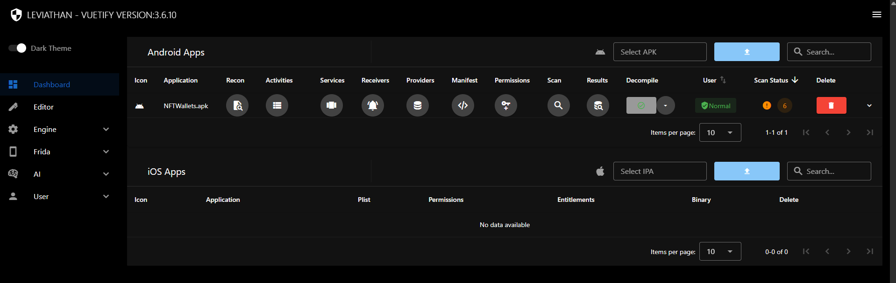

<p align="center">
  <picture>
    <source media="(prefers-color-scheme: dark)" srcset="logo-dark.svg">
    
  </picture>
</p>

# Leviathan: Mobile security analysis framework

**Android & iOS** · **Docker Compose** 

Static analysis, decompilation, and runtime instrumentation for Android and iOS applications through a web interface. Leviathan brings application metadata, source code, findings, and Frida sessions into one workspace.

Android analysis uses AppShark and decompilation tools including JADX and Vineflower. iOS analysis provides Mach-O inspection, ARM disassembly, and per-function pseudocode. Frida supports runtime inspection on connected devices.




## Documentation

- [Quick Start](#quick-start)
- [Usage](#usage)
- [Environment configuration](#environment-variables)
- [Features](#features)
- [AppShark rule packaging](Services/Engine/Rules/README.md)
- [Service configuration](docker-compose.yml)
- [Development](#development)
- [Built With](#built-with)
- [License](#license)

## Quick Start

Requires Docker with the Compose plugin. The analysis engine runs memory-intensive JVM tools; configure Docker's memory allocation and the scan limits in [docker-compose.yml](docker-compose.yml) for your machine.

For runtime instrumentation, you also need a compatible Frida setup on your test device and a connection the backend can reach. Static APK/IPA analysis does not require a connected device.

**1. Configure the environment**

From the repository root:

```sh
cp .env.example .env
```

In PowerShell, use `Copy-Item .env.example .env`.

Generate a random secret with Python:

```sh
python -c "import secrets; print(secrets.token_urlsafe(48))"
```

Run this separately for each secret. Set `SECRET_KEY`, `POSTGRES_PASSWORD`, and `INTERNAL_SERVICE_TOKEN` in `.env`. Signing and internal-service secrets must contain at least 32 characters; example placeholders prevent backend startup.

**2. Build and start**

```sh
docker compose up --build
```

For custom AppShark rules, add your JSON files to [Services/Engine/Rules](Services/Engine/Rules/README.md) before building the engine image.

**3. Open Leviathan**

Visit [http://localhost:3000](http://localhost:3000), register an account, and sign in.

## Usage

1. Upload an APK or IPA from the dashboard, or use bulk upload for multiple applications.
2. Open the application to inspect its metadata, components, permissions, or binary details.
3. For Android, configure rules and scan settings in **Engine**, run analysis, and review findings alongside decompiled source.
4. For iOS, browse functions, disassembly, control-flow graphs, pseudocode, and cross-references.
5. For runtime inspection, open **Frida Devices**, select a reachable device and application, and use the session tools or script editor.

Manage the local stack from the repository root:

```sh
docker compose up -d          # Start in the background
docker compose ps             # Show service status
docker compose logs -f backend engine
docker compose down           # Stop the stack; keep named data volumes
```

### Environment Variables

Copy [`.env.example`](.env.example) to `.env` and configure these values before starting the stack.

| Variable | Description | Default / requirement |
| --- | --- | --- |
| `SECRET_KEY` | Backend signing key for user authentication | Generate a random value of at least 32 characters |
| `JWT_SECRET_KEY` | Optional separate key for Flask-JWT-Extended | Falls back to `SECRET_KEY` when unset |
| `POSTGRES_USER` | PostgreSQL username | `postgres` |
| `POSTGRES_PASSWORD` | PostgreSQL password | Replace the example value |
| `POSTGRES_DB` | PostgreSQL database name | `leviathan_db` |
| `CORS_ORIGINS` | Comma-separated browser origins allowed to access the API | `http://localhost:3000` |
| `INTERNAL_SERVICE_TOKEN` | Shared credential for AI/MCP access to permitted backend operations | Generate a random value of at least 32 characters; keep it consistent across services |

Service ports, worker concurrency, scan memory limits, and frontend API addresses are configured in [docker-compose.yml](docker-compose.yml). Adding an arbitrary variable to `.env` only affects a service if Compose passes it through.

## Features

- **Application workspace:** Upload APKs/IPAs, browse application metadata, and manage an analysis inventory.
- **Queued analysis:** Configure Android scans, monitor task status, and inspect engine logs.
- **Source inspection:** Browse decompiled code with search, bookmarks, and definition navigation.
- **Findings review:** Filter results, inspect source/sink details, and suppress false positives.
- **Frida integration:** Browse devices and applications, manage sessions, and inspect streamed output.
- **Script editor and REPL:** Work with Frida scripts through the browser interface.
- **MCP integration:** Expose stored scan information and source context to compatible triage clients.

### iOS

- IPA metadata, Info.plist, entitlements, and declared permissions.
- Mach-O segments, sections, load commands, and encryption-state inspection.
- Imports, exports, symbols, functions, and Objective-C/Swift class information.
- Extracted strings with browsing and search.
- ARM disassembly with basic blocks, control-flow graphs, and address navigation.
- Per-function C pseudocode through r2ghidra.
- Address and Objective-C selector cross-references, plus static crypto-call findings.

### Android

- APK metadata, hashes, SDK versions, and signing information.
- AndroidManifest.xml and declared-permission inspection.
- Activities, services, receivers, and providers with exported status and intent filters.
- JADX decompilation and the dex2jar/Vineflower pipeline.
- AppShark static analysis with configurable rules and per-scan settings.
- Findings linked to source details, with filtering and false-positive suppression.
- TruffleHog secret scanning of decompiled code.

## Development

Start the stack with frontend hot reload:

```sh
docker compose -f docker-compose.yml -f docker-compose-dev.yml up --build
```

The frontend remains available at [http://localhost:3000](http://localhost:3000). The development override mounts the UI source into the frontend container.

| Directory | Purpose |
| --- | --- |
| `Services/Frontend/ui` | Vue, Vuetify, and Vite web interface |
| `Services/Backend` | Flask API, database models, and backend Celery tasks |
| `Services/Engine` | AppShark, decompilers, secret scanning, and engine workers |
| `Services/AI` | MCP service for scan and source context |
| `Services/Nginx` | Reverse-proxy configuration |

## Built With

Leviathan uses Vue, Vuetify, Flask, Celery, Redis, PostgreSQL, and Docker. Its analysis and instrumentation integrations include:

- [AppShark](https://github.com/bytedance/appshark), built from the [configured fork](https://github.com/cxxsheng/appshark).
- [JADX](https://github.com/skylot/jadx) and [Vineflower](https://github.com/Vineflower/vineflower).
- [Androguard](https://github.com/androguard/androguard), [LIEF](https://github.com/lief-project/LIEF), and [Strongarm](https://github.com/datatheorem/strongarm).
- [Radare2](https://github.com/radareorg/radare2) and [r2ghidra](https://github.com/radareorg/r2ghidra).
- [Frida](https://frida.re) and [TruffleHog](https://github.com/trufflesecurity/trufflehog).

## License

[MIT](LICENSE)
